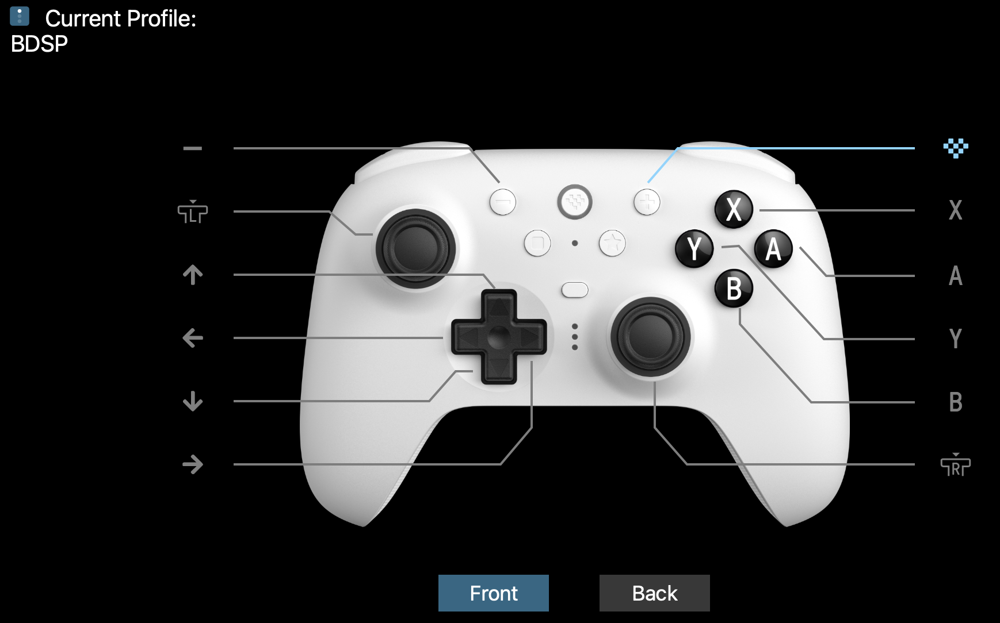
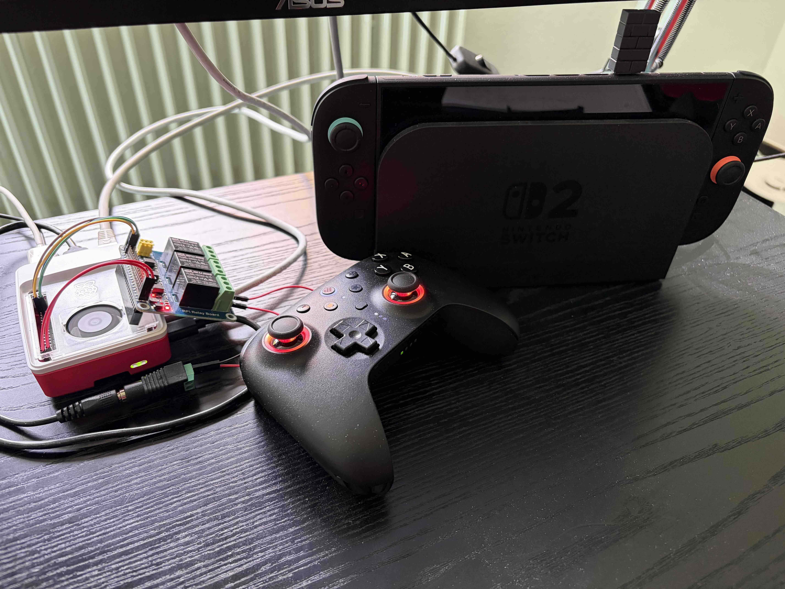

# Pokémon BDSP shiny detection

## Description

This project is the continuation of [another repository](https://github.com/lowiqbrick/firered_shiny_detector).

The basis of this project are the brilliant diamond/shining pearl (bdsp) pokemon games. 

In these games it is possible to catch shiny Pokémon. These are rare instances of Pokémon which posses different colors than regular Pokémon. Think of them as the Pokémon equivalent of albinos in the animal world. They don't learn different or stronger moves than regular Pokémon. It's just bragging rights. Obtaining them requires either luck of lots of hours.

With a third party video game controller that has macros build in, it is possible to hunt for shiny Pokémon. That is because there are instances of legendary Pokémon encounters that are stationary, since a Pokémon being shiny is always rolled the moment a battle begins. So a macro can be run to automatically start battles and reset the game over and over again. One such cycle takes approximately a minute. With the odds of a Pokémon being shiny being to 1/4096 (in bdsp), one can expect to encounter a shiny Pokémon approximately every 68.3 hours. A controller can take care of that with a macro, saving someone from having to do that oneself. 

The issue with this approach is that the controller does that forever, even if a shiny Pokémon actually shows up.

This requires something to turn the controller of once a shiny encounter is present. This is where this repository comes in.

## Controller Macro

### prerequisites

Since the home-button can't be manually entered, when creating a macro in the [8BitDo Ultimate Software V2](https://app.8bitdo.com/Ultimate-Software-V2/) one button has to be remapped. In this project the +-button was chosen for this purpose.

### generalized macro

The macro used in this project is shown in the image above. The image is taken from the controllers configuration software [8BitDo Ultimate Software V2](https://app.8bitdo.com/Ultimate-Software-V2/).

It is supposed to be started on the home-screen of the switch console. Once started it starts the game,loads the save file, starts the fight with a stationary legendary pokemon and closes the game for the next cycle.

This macro was used to successfully detect a giratina, though it should work for every stationary encounter. Some tweaking to the timings might be necessary.

Additional information may be gained [here](record.md).

## Hardware

The setup starts with a capture card (not pictured). The card used is a Zasluke 4k USB3.0 HDMI Video Capture-Card. This card converts the HDMI signal of the console and converts it into a usb signal that can be taken in by a [Raspberry Pi 5](https://www.berrybase.de/raspberry-pi-5-1gb-ram). The Raspberry Pi controls an [external board with relays](https://www.waveshare.com/wiki/RPi_Relay_Board) that can (upon termination of the program) cut power to the controller executing the macro.

This is possible, because the used [8BitDo Ultimate 2 Bluetooth Controller](https://www.8bitdo.com/ultimate-2-bluetooth-controller/) was modified on the hardware level. The internal battery was disconnected from the board and an external 4V power supply was connected, via the normally open connection of a relay. That allows to cut power to the controller and sidesteps the limitations imposed by a battery (finite runtime and charging requirement).

After the power is cut the game isn't reset anymore and the Pokémon can be collected/caught, whenever the next time the operator of the setup checks back in.

## Execution

1. Replicate the hardware setup described above and put the macro on the controller.
2. Start the program and turn the controller on. Start the console and put the menu cursor on the your copy of bdsp.
3. Wait for success.

## SMS notifications

The program also contains the functionality to send an SMS via the [Twilio](https://www.twilio.com/en-us) service, in case a shiny is found. If this functionality is not desired the class and it's method calls can just be deleted, without impacting the rest of the program.